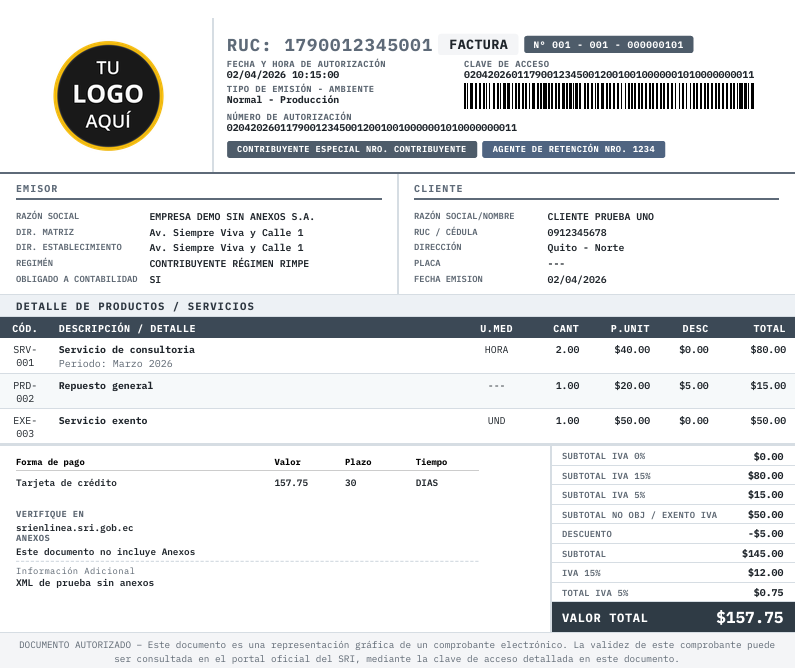
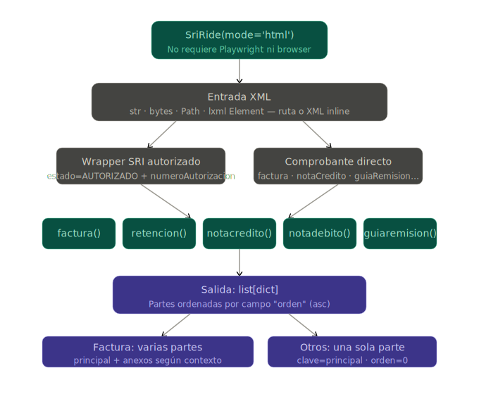
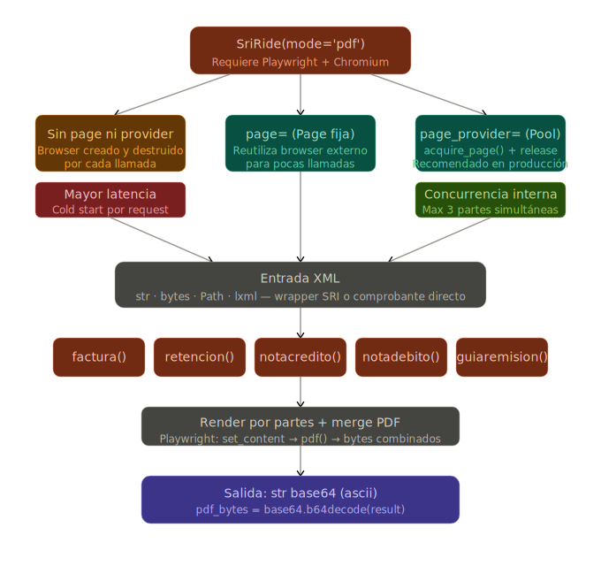
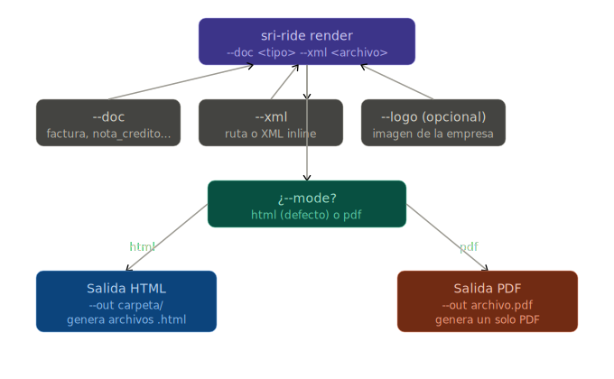

<p align="center">
  
</p>

<p align="center">
<a href="https://docs.python.org/3/"></a>
<a href="./LICENSE"></a>
<a href="#inicio-rapido/"></a>
<a href="#inicio-rapido/"></a>
</p>


**sriRide** es una librería asíncrona en Python diseñada para procesar comprobantes electrónicos del SRI y generar sus representaciones en formato **HTML** o **PDF** de manera y eficiente. Soporta múltiples tipos de documentos, como facturas, notas de crédito, notas de débito, guías de remisión y comprobantes de retención, aceptando diversas formas de entrada XML.

La librería está integrada con soporte para reutilización de sesiones de navegador mediante Playwright, lo que mejora el rendimiento y el manejo de recursos en escenarios de alta concurrencia.
Ejemplo de Salida de factura mostrando estructura con datos ficticios 

<p align="center">
  
</p>
<p align="center">
  <em>Ejemplo de render de factura con datos ficticios. La información mostrada es únicamente demostrativa y puede contener inconsistencias (p. ej., combinaciones tributarias no válidas en la práctica).</em>
</p>

# 🚀 Prueba rápida

### 🖥️ CLI

Instala el paquete desde PyPI (Entorno Global):

```bash
#usando pip
pip install sri-ride

#usando uv
uv pip install sri-ride
```
Entorno aislado:

```bash
#desde la raiz de tu entorno
uv venv
.venv\Scripts\activate   # En Windows
source .venv/bin/activate  # En Linux/macOS

uv pip install sri-ride
```


> [!IMPORTANT]
> **Para archivos PDF:** > Si usas el modo pdf necesitas tener instalado chromium en tu sistema:
> 
> ```bash
> #esto instala una version ligera de chromium en tu sistema
> playwright install chromium --only-shell
> ```

Generando un html a partir de un xml autorizado del SRI:

```bash
# HTML factura con logo (genera .html en la carpeta definida en --out)
sri-ride render --doc factura --xml factura.xml --mode html --logo logo.png --out carpeta

# HTML guia_remision con logo (genera .html en la carpeta definida en --out)
sri-ride render --doc guia_remision --xml guia_remision.xml --mode html --logo logo.png --out carpeta
```

Generando un pdf a partir de un xml autorizado del SRI:
la libreria instancia chromium internamente e imprime en pdf, necesitas haber instalado chromium, el navegador corre desde cero el tiempo de respuesta es de 1 a 4 segundos dependiendo de tu sistema. Recomendado solo para pruebas o para render pocos recurrentes ( 5 PDFs/h)

```bash
# PDF factura con logo (genera .pdf en el directorio actual)
sri-ride render --doc factura --xml factura.xml --mode pdf --logo logo.png --out archivo.pdf

# PDF guia_remision con logo (genera .pdf en el diretorio actual)
sri-ride render --doc guia_remision --xml guia_remision.xml --mode pdf --logo logo.png --out archivo.pdf
```
# Libreria

Librería asíncrona para generar documentos del SRI (Ecuador) a partir de XML:
* Facturas
* Notas de crédito / débito
* Guías de remisión
* Retenciones

Soporta salida en:
* 🧾 HTML (estructurado por partes)
* 📄 PDF (base64 listo para descarga)

### ⚙️ Inicialización

```bash
from sriRide import SriRide

#Html
ride = SriRide(mode="html")
#Pdf
ride = SriRide(mode="pdf")
```

### Metodos de entrada
La libreria admite estos metodos y argumentos de metodo por tipo de documento:
```bash
ride = SriRide(mode="html/pdf")

#metodos
ride.factura | ride.guiaremision | ride.retencion | ride.notacredito | ride.notadebito

#argumentos
#xml flexible la libreria acepta:
xml: str | bytes | Path | lxml.Element | lxml.ElementTree

#logo (jpg, png, svg) max 1MB o 1024x1024, flexible la libreria acepta:
logo: base64 | Path | data URI | SVG inline
```
Es fundamental diferenciar entre el modo html y el modo pdf, ya que la estructura de los datos que devuelve la librería cambia por completo.

### Manejo de Salida en Modo HTML

En este modo, la librería no requiere Playwright y devuelve una lista de diccionarios. Cada diccionario representa una "parte" del documento (útil para facturas que tienen anexos o secciones separadas).

```bash
from sriRide import SriRide

ride = SriRide(mode='html')
partes = await ride.factura(xml="factura.xml")

# --- PROCESAMIENTO ---
# DISCO: [open(f"{p['clave']}.html", "w").write(p['html']) for p in partes]
# MEMORIA (String): html_unico = "".join([p['html'] for p in partes])
# MEMORIA (Stream): html_buffer = io.StringIO("".join([p['html'] for p in partes]))

# Ejemplo de uso en memoria:
html_para_web = "".join([p['html'] for p in partes])
# return Response(content=html_para_web, media_type="text/html")
```


### Manejo de Salida en Modo PDF

En modo pdf, la librería utiliza Playwright internamente para renderizar y combinar todas las partes en un único archivo. El resultado es una cadena de texto en base64 (ASCII).
```bash
import base64
from sriRide import SriRide

ride = SriRide(mode='pdf')
pdf_b64 = await ride.factura(xml="factura.xml")

# --- PROCESAMIENTO ---
# DISCO: open("f.pdf", "wb").write(base64.b64decode(pdf_b64))
# MEMORIA (Bytes): pdf_bytes = base64.b64decode(pdf_b64)
# MEMORIA (Stream): pdf_buffer = io.BytesIO(base64.b64decode(pdf_b64))

# Ejemplo de uso en memoria:
pdf_bytes = base64.b64decode(pdf_b64)
# Enviar_por_email(pdf_bytes)
```

### Configuración avanzada para renderizado Pdf

La generación de documentos PDF requiere un motor de navegador (Playwright/Chromium) para transformar el contenido dinámico en un formato listo para impresión. Sin embargo, abrir y cerrar una instancia del navegador por cada documento es una operación costosa en términos de CPU, memoria y tiempo de respuesta.

Para optimizar esto, sriRide permite tres niveles de configuración, adaptándose desde scripts sencillos hasta APIs de alta demanda.

Para generar PDFs, existen dos argumentos extras y puedes pasar uno de ellos jumto a `mode`:

1. Uso de page (Reutilización de página existente)
Ideal para procesos donde ya tienes una instancia de Playwright abierta o necesitas inyectar la librería en un flujo de navegación existente.
```bash
from playwright.async_api import async_playwright
from sriRide import SriRide

async with async_playwright() as p:
    browser = await p.chromium.launch()
    context = await browser.new_context()
    # Logica extra aquí
    # Creamos nuestra propia página
    my_page = await context.new_page()

    # Configuramos la librería usando la página existente
    ride = SriRide(mode='pdf', page=my_page)
    
    # El renderizado usará 'my_page' y no la cerrará al terminar
    pdf_b64 = await ride.factura(xml_input)
    
    await browser.close()
```
2. Uso de page_provider (Pool de páginas para producción)
Recomendado para entornos de alta concurrencia o aplicaciones en producción. Permite usar un gestor de recursos (pool) para evitar el costo de abrir/cerrar el navegador en cada petición.

El objeto page_provider debe cumplir con un contrato simple: tener el método acquire_page().
```bash
from sriRide import SriRide

class MyPagePool:
    async def acquire_page(self):
        # Lógica para obtener una página de un pool (ej. playwright-cluster)
        return page 

    async def release_page(self, page):
        # Opcional: Lógica para devolver la página al pool
        pass

# Configuración con el proveedor
pool = MyPagePool()
ride = SriRide(mode='pdf', page_provider=pool)

# La librería solicita una página, renderiza y la libera automáticamente
pdf_b64 = await ride.factura(xml_input)
```


# 🖥️ CLI

```
sri-ride 0.1.0
Renderizar comprobantes XML SRI a HTML o PDF.

USO:
  sri-ride render [opciones]

SUBCOMANDOS:
  render        Procesa un comprobante SRI y genera salida HTML o PDF.

OPCIONES (render):
  --doc <tipo>              Tipo de comprobante a renderizar. (requerido)
                            Valores:
                              factura
                              guia_remision | guiaremision
                              nota_credito  | notacredito
                              nota_debito   | notadebito
                              retencion

  --xml <ruta|xml>          Ruta a archivo XML o XML inline. (requerido)

  --mode <formato>          Formato de salida. (opcional)
                            Valores: html, pdf
                            Default: html

  --logo <ruta>             Ruta de logo opcional (png, svg).

  --out <destino>           Destino de salida. (requerido)
                            - HTML: carpeta de salida
                            - PDF: archivo .pdf

  --template-dir <dir>      Directorio de plantillas personalizado.

  --template-name <file>    Nombre de plantilla personalizada.

REGLAS:
  * Debe usarse un subcomando válido (ej: render).
  * --doc, --xml y --out son obligatorios.
  * En modo html, --out debe ser carpeta.
  * En modo pdf, --out debe ser archivo .pdf.
  * Si --xml no es ruta válida, se interpreta como XML inline.

EJEMPLOS:
  sri-ride render --doc factura --xml factura.xml --out salidas/factura.pdf --mode pdf

  sri-ride render --doc factura --xml factura.xml --out salidas/html_partes

  sri-ride render --doc guia_remision --xml guia.xml --mode pdf --logo logo.svg --out salida.pdf

ERRORES:
  exit code 2  -> argumentos inválidos
  exit code 1  -> error en ejecución
```


# ℹ️ Estado del proyecto

sriRide se encuentra actualmente en versión 0.1.x (beta temprana).

Esto implica que la librería está en evolución activa: se siguen afinando detalles, mejorando el rendimiento y expandiendo capacidades. La API es funcional y usable, pero algunos aspectos pueden ajustarse en futuras versiones para mejorar la experiencia general.

### 🧪 Alcance y validación

La librería ha sido probada principalmente con:

* Documentos simulados
* Un conjunto limitado de comprobantes reales autorizados por el SRI

sriRide no realiza cálculos fiscales.
Su propósito es representar visualmente la información contenida en el XML, generando una copia en formato HTML o PDF sin alterar los datos originales.

Sin embargo, en escenarios más complejos (como compensaciones, subsidios u otros casos especiales), es posible que ciertos detalles no se representen completamente o requieran validación adicional.

### 🧪 Recomendaciones de uso

La librería puede utilizarse en proyectos reales, pero se recomienda:

Probar con tus propios documentos reales del SRI antes de su uso en producción.
Validar que la representación visual cumpla con tus necesidades específicas.
Mantener control sobre las versiones mientras el proyecto continúa madurando.

### ⚡ Rendimiento

El rendimiento de sriRide es adecuado para la mayoría de casos de uso actuales. Sin embargo, al encontrarse en una etapa temprana (0.1.x), el pipeline interno de procesamiento de XML y construcción de contexto aún está en proceso de optimización.

En versiones futuras se evaluarán mejoras orientadas a:

* Optimización en la construcción del contexto intermedio
* Mejora en el uso de memoria y procesamiento por documento

Estas optimizaciones podrían traducirse en una menor latencia y mejor desempeño en escenarios de alto volumen, aunque no se garantizan cambios específicos en tiempos de ejecución.

### 🤝 Nota
Los datos fiscales en los xml para test fueron pensados para validar estructura, los datos fiscales fueron agregados al azar. Si desea validar fidelidad de datos debe usar un xml real autorizado por el sri.

El objetivo de sriRide es ofrecer una base sólida, flexible y eficiente para el renderizado de comprobantes del SRI.
Durante esta etapa, el feedback y uso en distintos escenarios ayudan directamente a fortalecer su estabilidad.